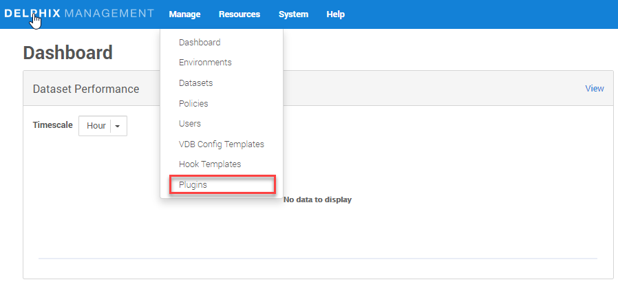
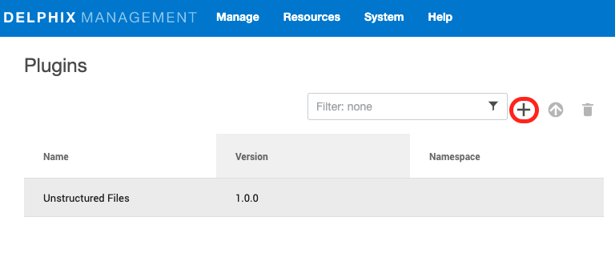
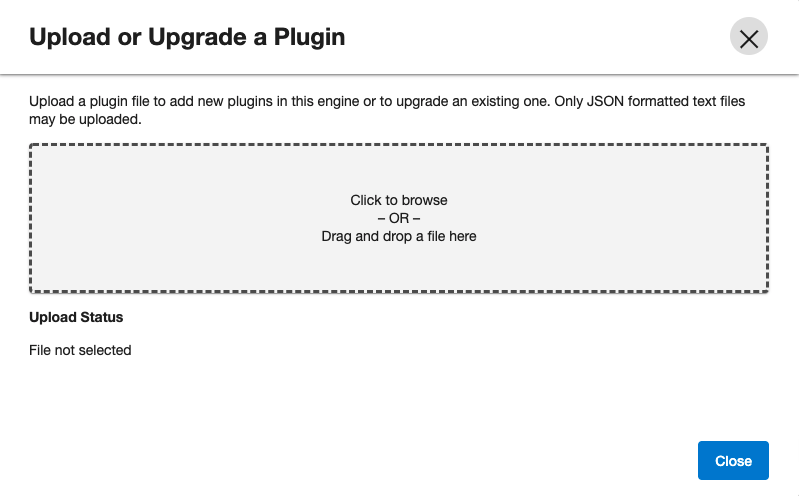
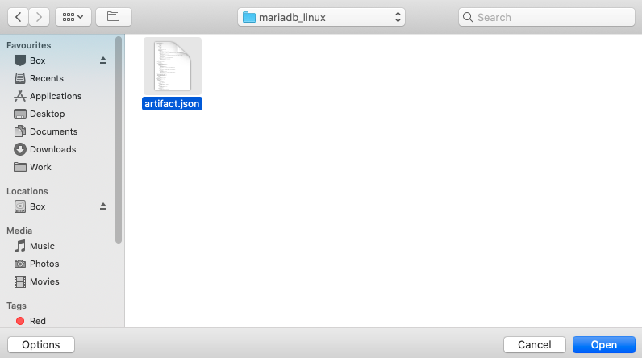
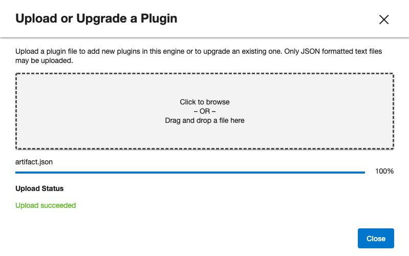
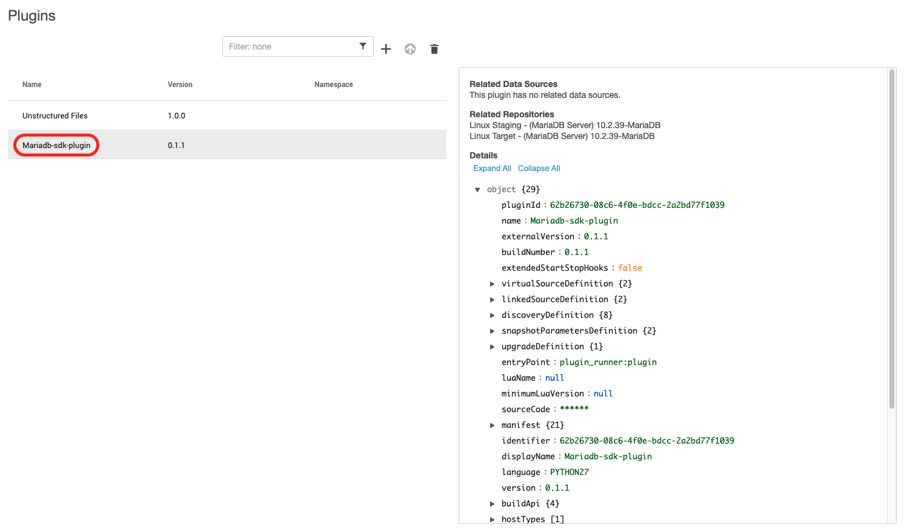

# Plugin Installation

## Prerequisites

-   Delphix Engine of version 6.0.x
-   Install MariaDB Binaries on source, staging, and target servers

## Installing the MariaDB Plugin

### **Method 1:** Using GUI

1. Click on **Manage** (present on top-left of this page) and then **Plugins**.  
   
      

2. Click on **(+)** icon.  
   
      

3. Select the plugin `artifacts.json` from your device.   
   
      

4. Click on **Open** button.  
   
      

5. Click on **Close** button.
   
      

6. See the plugin version in **Plugins** section. 

      

### **Method 2:** Using dvp command

`dvp upload --upload-artifact artifact.json --delphix-engine <Delphix_Engine_Name> --user <username> --password <password>`

Delphix Engine's documentation on installing plugins: 
[PluginManagement](https://docs.delphix.com/docs/datasets/unstructured-files-and-app-data/delphix-engine-plugin-management).
